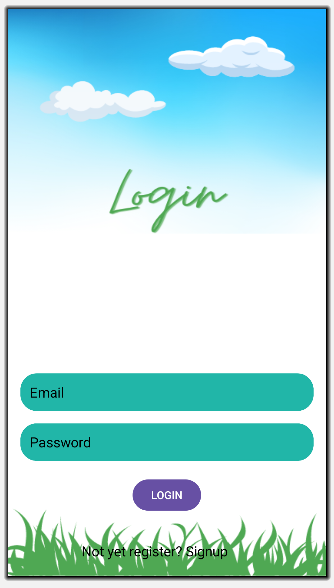

# Firebase-Login_Signup-Page
This repository contains the source code for a simple Android login and signup page connected with Firebase Authentication. Users can sign up for a new account or log in with an existing account using their email and password.

## Features

- User authentication with Firebase Authentication.
- Sign up for a new account with email and password.
- Log in with an existing account.
- Error handling for invalid credentials and network issues.
- Responsive UI design.

## Installation

1. Clone the repository:
   ```bash
   git clone https://github.com/jenishborah/firebase-login_signup-Page.git
   
2. Set up Firebase:

- Create a Firebase project in the Firebase Console.
- Add an Android app to your Firebase project and download the google-services.json file.
- Place the google-services.json file in the app/ directory of your Android project.

3. Open the project in Android Studio:
- Open Android Studio.
- Select "Open an existing Android Studio project" and choose the cloned repository directory.
  
4. Build and run the project:

- Build and run the project on an Android device or emulator using Android Studio.

## Usage
- After launching the app, users will see a login screen.
- New users can click on the "Sign Up" button to create a new account by providing their email and password.
- Existing users can log in by entering their email and password and clicking on the "Log In" button.
- Upon successful authentication, users will be directed to the main application screen.

## Resources

The [background images](/Resources/Images/) and other resources are uploaded in the [Resources folder](/Resources/)

- Add the iamges and [edittext.xml](/Resources/edittext.xml) file in app/src/main/res/drawable/ in your android studio project.
- Update the [colors.xml](/Resources/colors.xml) file in app/src/main/res/values/colors.xml  in your android studio project.
  
## Screenshots




## Contributing
Contributions are welcome! If you want to contribute to this project, please follow the contribution guidelines.

## License
This project is licensed under the MIT License.
